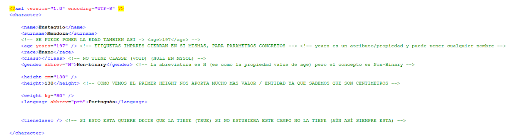

# **APUNTES XML**
Estos son los diferentes apuntes que he ido tomando durante las clases sobre el lenguaje de marcas **XML**

## SMGL

SGML fue el primer lenguaje de marcas que existió a nivel global. Fue desarrollado en 
los años 80 con la intención de crear documentos electrónicos estructurados y complejos. 
SGML sentó las bases para la creación de otros lenguajes de marcado, como HTML y XML, entre otros.

Posteriormente, en los años 90, apareció el lenguaje HTML el cuál introdujo la capacidad de enlazar documentos, 
lo que lo hizo muy popular. Sin embargo, hubo un problema. El creador de HTML lanzó un navegador llamado 
Mosaic en 1993, y luego surgió Netscape. Microsoft adquirió una empresa y renombró su navegador como 
Internet Explorer. Microsoft logró imponer Internet Explorer en todos sus ordenadores, incluso integrándolo 
en el núcleo o núcleo del sistema operativo, lo que lo hizo difícil de desinstalar.

Internet Explorer interpretaba HTML de manera deficiente, mientras que Netscape respetaba los estándares. Los desarrolladores se 
vieron obligados a adaptarse a la forma en que Internet Explorer funcionaba, lo que llevó al declive de Netscape. Sin embargo, 
Netscape liberó el código fuente de su navegador, conocido como Mozilla, lo que permitió que surgieran proyectos como Firefox.

## ¿QUE ES XML?
Es un lenguaje de marcas diseñado para describir datos estructurados y facilitar el intercambio de información entre diferentes sistemas informáticos. 
A diferencia de otros lenguajes, XML ofrece soporte a bases de datos y resulta especialmente útil cuando varias aplicaciones necesitan comunicarse 
entre sí o integrar información.


## LA HISTORIA DE XML
XML surge como un subconjunto del lenguaje SGML, creado por IBM en los años 70 y normalizado por la ISO en 1986, 
con la intención de almacenar y compartir grandes cantidades de información en distintas plataformas. HTML, 
creado por **Tim Berners Lee en 1989**, fue la aplicación más conocida de SGML y tenía limitaciones en cuanto a la 
combinación de elementos de diferentes vocabularios y la complejidad para los navegadores al interpretar el código. 
Para solucionar estos problemas, se buscó definir un subconjunto de SGML que permitiera mezclar elementos de diferentes lenguajes, 
la creación de analizadores simples y hacer hincapié en que no se acepte nunca un documento con errores de sintaxis, lo que dio lugar a la creación de XML. 
XML se enfoca en hacer las cosas más sencillas para los programas automáticos que necesiten interpretar el documento, 
en lugar de facilitar la escritura manual de documentos como SGML.
>Más información sobre Tim Berners Lee: [WIKI_TIM](https://es.wikipedia.org/wiki/Tim_Berners-Lee)


## VENTAJAS DE XML SOBRE OTROS LENGUAJES

* **Es extensible** - XML permite crear lenguajes de marcas específicos para diferentes necesidades, lo que lo hace altamente flexible y adaptable.
* **Es compatible con bases de datos** - XML es compatible con bases de datos, lo que permite una fácil integración con aplicaciones y sistemas de bases de datos.
* **Es legible para las personas** - A diferencia de algunos otros formatos de datos, XML utiliza etiquetas legibles para los humanos, lo que lo hace más fácil de entender y editar para los programadores y usuarios.

## ESTRUCTURA DOCUMENTO XML 

* **CABECERA:**
Todo archivo XML contiene la primera línea(cabecera) **<?xml version="1.0" encoding="UTF-8"?>**. 
Esta sirve para especifica la versión de XML que se está utilizando y la codificación de caracteres utilizada en el archivo. 


* **CUERPO:**
El cuerpo del documento se compone de una estructura jerárquica de elementos o etiquetas que contienen información organizada en forma de texto. 
Cada elemento se define mediante una etiqueta de apertura y una etiqueta de cierre. 
Por ejemplo, el elemento "libro" puede definirse con las etiquetas <libro> y </libro>, además estos elementos pueden contener atributos. Los cuales
se definen dentro de la etiqueta de apertura de un elemento y contienen información adicional sobre el elemento en cuestión. Por ejemplo, el atributo 
"id" se puede usar para identificar de manera única el elemento.



## __VALIDACIÓN__

Hay dos formatos de archivo que nos permiten validar XML:
* XSD
* DTD

Existen dos formatos utilizados para validar documentos XML: **DTD** (Document Type Definition) y **XSD** (XML Schema Definition). 
Ambos formatos describen la estructura y contenido de un documento XML y establecen reglas para los elementos y atributos del mismo.
La DTD es un formato más antiguo y sencillo de utilizar. Consiste en un archivo de texto que contiene reglas para validar 
el documento XML. Define los elementos permitidos y cómo se relacionan entre sí. La validación de un documento XML 
con una DTD implica comprobar si el documento cumple con las reglas establecidas en la DTD. Sin embargo, las DTD tienen limitaciones, 
como la incapacidad de validar tipos de datos o definir restricciones complejas.

Por otro lado, el XSD es un formato más moderno y complejo. Define un esquema XML que describe la estructura y contenido del documento. 
Los esquemas XSD son más flexibles y permiten definir tipos de datos personalizados y restricciones más complejas. 
Además, los esquemas XSD son utilizados para validar datos introducidos en formularios web, lo que resulta útil en 
aplicaciones de comercio electrónico y otras aplicaciones web.

Aunque históricamente las DTD han sido más utilizadas debido a su simplicidad, los esquemas XSD se están convirtiendo en 
la opción preferida para la validación de documentos XML debido a su mayor flexibilidad y capacidad para manejar casos 
más complejos de validación. No obstante, la elección entre DTD y XSD depende de las necesidades y requisitos específicos del proyecto.

##WWW

Antes de entender qué es WWW (www.google.es), es importante comprender qué es el *".es"*. A esto se le conoce como TLD (Dominio de nivel superior). Cuando ingresamos una página web como la 
mencionada en el navegador, lo primero que se lee es el ".es".
El sistema de nombres de dominio (DNS) guarda la información del TLD, lo que facilita y agiliza su clasificación. Todos los servidores de DNS comienzan a leer la dirección por el TLD.

Inicialmente, solo existían tres los cuáles pertenecian a Estados Unidos:
* .com 
* .edu 
* .net

Ponemos **WWW** para diferenciarlos del resto de servicios. Antes se podía acceder por el navegador a una web y utilizar FTP para 
transferir archivos (*ftp.ubuntu.com*). WWW remarca que cuando nos conectamos a esa dirección, con ese prefijo, nos vamos a conectar al 
puerto **80** .
Actualmente si por ejemplo entramos a enti.cat, el navegador utiliza HTTPS (no HTTP) y utiliza el puerto correspondiente. 
Hoy en día no se le da importancia a veces a WWW. Lo más habitual es:

* Mantenerlo y que se vea.
* Hacer una redirección de salto.

##HTML

HTML es el lenguaje de marcas más utilizado en la actualidad.
En 1991, Tim Berners-Lee creó el protocolo HTTP, sentando las bases para el desarrollo de HTML. Antes de ese momento, no existían 
herramientas para comunicarse o transferir información a través de Internet.
A finales de los años 90 y principios de los 2000, Flash se volvió dominante. Era un software propietario que permitía crear 
animaciones y contenido multimedia. Flash controlaba el sector sin competencia, lo que generaba muchos problemas de seguridad.
En 2008, se introdujo HTML5 como un borrador. Este estándar incluía etiquetas importantes, como la etiqueta de video, lo que permitía 
reproducir videos en la web sin depender de Flash. También se introdujeron etiquetas de audio para reproducir sonidos.
Internet Explorer dejó de ser utilizado porque los dispositivos móviles comenzaron a utilizar navegadores que 
cumplían con HTML5. HTML5 fue el factor determinante en el declive de Internet Explorer. En 2012, Microsoft decidió crear un nuevo navegador llamado Edge. La primera versión era muy similar a Internet Explorer en términos de rendimiento y no cumplía con los estándares adecuadamente. Aunque se mejoró su rendimiento, seguía teniendo problemas para interpretar los estándares. Edge tuvo cierta aceptación inicial, pero luego perdió popularidad. Microsoft optó por utilizar Chromium para crear un nuevo navegador.

Internet Explorer tuvo una rivalidad con Netscape, otro navegador, y terminó derrotándolo.
Cuando Netscape desapareció, su código fue liberado por la fundación Mozilla. El objetivo de Mozilla 
era crear un navegador que respetara los estándares web. Luego surgieron Opera, Chrome y otros navegadores basados en ellos.

>Firefox no depende de ninguna compañia (es open-source).
>Opera no es muy fiable por temas de seguridad.

### ETIQUETAS

Existen dos tipos de etiquetas:

* ```<class></class>```: Etiquetas par. Se cierra con otra etiqueta.
*  ```<age value = "197" />```: Etiquetas impar. Cierra la misma etiqueta.

Una vez se ha creado un tipo de etiqueta u otro para un personaje, **todos** deben tener la misma.

**Todos los documentos HTML empiezan con un *index.html***.
Todo texto, todo elemento tiene que ir dentro de una **etiqueta o elemento de bloque**. Esta sería la etiqueta de párrafo:

* ```<p>ola k ase</p>``` 

Para poner un texto en cursiva utilizamos ```</em>```, **la semántica es lo que aporto HTML 5**.

* ```<h1></h1>``` : Cabeza número 1. Es el titulo de la pagina.
* ```<h2></h2>``` : Cabecera número 2. Dentro de esta puede haber h3,h4...
* ``````: Para las imágenes, esta etiqueta se cierra solo con la contra barra. Se utiliza **src** para indicar el link de la imagen.

Todo documento HTML tiene una etiqueta raíz. La etiqueta raíz de HTML es ```**<html></html>**``` . Pero a la vez dentro de todo documento HTML, tiene que haber dos etiquetas más obligatorias:

* ```<head></head>``` : Va la información de como se tiene que interpretar cosas dentro del body o de la página misma. Aquí dentro van etiquetas como ```<title></title>``` , ```<style></style>``` (*estas dos etiquetas son siblings, ya que están al mismo nivel*)
* ```<body></body>``` : Abre y cierra los contenidos.

>Head y body son etiquetas hermanas o siblings en inglés, ya que están en la misma parte del árbol. Las etiquetas que están en el mismo nivel son etiquetas hermanas.

* ```<title></title>``` : Se utiliza para el título de la pestaña.

La primera línea de todas es el DTD. Esta línea la tiene que tener todo documento HTML. Si no introducimos esta línea habrá problemas de **compatibilidad y lo interpretara mal**.
> ```<!DOCTYPE html>```

* ```<marquee></marquee>``` : Con esta etiqueta se mueve el texto por la pantalla. 
* ```<blink></blink>``` : Con esta etiqueta el texto parpadea.
* ```<blockquote></blockquote>``` : Es para hacer texto mas especial, como citas.
* ```<form></form>```
* ```<input></input>``` : Permite introducir valores.

### TIPOS DE ELEMENTOS
* Elementos en bloque: h1,h2,p ... Los elementos en bloque fuerzan el salto de linea. Son como cajas.
* Elementos en línea : **strong**(hace el texto en negrita, refuerza el texto), _em_ ... **Los elementos en línea van dentro de los elementos en bloque.**
>Los elementos en línea(```<a>```) no tienen margin, padding, width, height ...

### LISTAS
Las etiquetas **ul** se utilizan para hacer listas. 
* ```<ul></ul>``` : lista sin ordenar (**unordered list**)
* ```<ol></ol>``` : lista ordenada (**ordered list**)
* ```<li></li>``` : li se utiliza para los elementos de la lista. (**list item**). Siempre va dentro de o **ul** u **ol**.

Ejemplo:

```HTML 
<ul>
	<li>Manzanas</li>
	<li>Peras</li>
	<li>Limones</li>
</ul>

<ol>
	<li>Limones</li>
	<li>Arbol</li>
	<li>Naranja</li>
</ol>
```

### ENLACES
* ```<a></a>``` : La etiqueta "a" se utiliza para realizar enlaces, para el **hipertexto**. Es una etiqueta en línea. Se pueden incrustar imágenes, videos, audios etc.
* Se utiliza **href** para hacer referencia al enlace.
* Se utiliza **alt** para insertar un texto alternativo.
* Con el **title** es el texto que sale cuando pasamos el ratón por encima.

El texto alternativo sirve para que el enlace siga funcionando aunque la imagen no cargue.


### BLOQUES LOGICOS

* ```<header></header>``` : Es una etiqueta semántica, no aporta nada visual inicialmente. Header no es como ```<head>```, header esté ya dentro del body, es la "cabeza" del body.
>**La semántica significa lo que es y lo que significa. Es el significado de lo que escribimos más allá del propio texto.**
---
* ```<main></main>``` : Aquí van los contenidos del cuerpo.
* ```<footer></footer>``` : Es el pie de página.
* ```<nav></nav>``` : Proporciona enlaces de navegación. Esta etiqueta puede estar en cualquier elemento. Dentro del de header, main, del footer.
>Todas estas etiquetas son siblings.


### ID

ID identifica un elemento de una página de manera única. Cada vez que queramos acceder a un elemento y sus propiedades utilizaremos su ID.
```<p id="numerito">ESTO ES EL HTML INTERNO DE P</p>```: INNERHTML es el texto interior que contiene y que después puede ser utilizado para cambiar su contenido con JavaScript.

##CSS

Se decide "en cascada", porque todo va afectando a lo siguiente, no hace falta volver a definir las propiedades de una etiqueta de nuevo.

* ```<style></style>``` : Esta etiqueta nos permite cambiar el estilo. Se utiliza con **CSS**
Todo elemento de bloque tiene:
* MARGIN: Margen exterior. 16px(arriba) 0(derecha) 128px(abajo) 20px(izquierda). Funciona como las agujas del reloj. El **px** se tiene que especificar a no ser que el valor sea 0, ya que se puede trabajar con varias unidades a parte de px.
* PADDING: Margen interior.
>Las etiquetas que editamos dentro de la etiqueta style las llamamos **selectores**.
>El body a su vez tiene su propio MARGIN. Está empujando hacia fuera.


>HTML es la estructura, CSS la forma, JavaScript la acción. 

* ```<link />```: Esta etiqueta permite referenciar ciertas configuraciones como por ejemplo la configuración de la etiqueta ```<style></style>``` o las hojas de estilo. Se utiliza **rel** para referenciar el nombre y **href** para introducir el nombre del archivo.
Displays: Es como se muestran los elementos en bloque.
* BLOCK 
* INLINE
* NONE
* FLEX : Cuando un elemento en bloque pasa a ser flexible los elementos en bloque que hay dentro se vuelven flexibles también.

##JSON

JSON (JavaScript Object Notation) es un lenguaje orientado al intercambio de datos. Es muy popular debido a su simplicidad y capacidad para ser interpretado por varios lenguajes de programación.
Con JSON abrimos y cerramos con llaves, no utilizamos etiquetas como en HTML.

| Lenguaje | name | 
| ---: | ---: |
| HTML | ```<name></name>```| 
| JSON | "name" |

JSON es más ágil (es puro JavaScript), no se utilizan validadores, es por eso que en entornos de trabajo como bancos se utiliza HTML en vez de JSON. Muchos bancos y amazon tienen los datos
almacenados en ambos (xml y json). Nos envían los archivos a nosotros en JSON para que sea más rápido, pero cuando pasa algo tienen los datos guardados en HTML.

## JAVASCRIPT 

JavaScript es un lenguaje de programación utilizado en el desarrollo web para agregar interactividad y funcionalidad a las diferentes páginas. 
Permite realizar acciones en respuesta a eventos, modificar elementos de la página en tiempo real y crear aplicaciones web completas 
tanto en el lado del cliente como en el servidor.

### VARIABLES

Para definir variables en JavaScript se utiliza la palabra reservada "let". No se indica el tipo de dato con el que tratamos, por lo tanto, utiliza un **tipado débil**. Esto quiere decir que es posible cambiar el tipo de dato de una variable de manera directa.
También se puede concatenar varios tipos de datos distintos.
Todas las variables por defecto ya existen, lo que pasa que están en estado "undefined" si no les asignas ningún valor.

### BUCLES

```js
for (let i=0; i < 10; i++){
	console.log(i)
	}
```

```js
let valor1 = 10;
let valor2 = 6;
	
	if (valor1 == valor2){
		console.log("Son iguales");
	}
	else if (valor1 > valor2){
		console.log("El valor1 es mayor");
	}
	else {
		console.log("El valor2 es mayor")
	}
```


```js
let contador = 0;
	while (contador < 10 ){
	console.log(contador)
	contador++;
	}
```


### FUNCIONES

```js
function saluds (){
	console.log("ola k ase");
}
saluda();	
```

En java script los parámetros son opcionales, por general no usarlos dará error, pero muchas veces imprimirá el resto del contenido. 

setInterval: Es una función que ejecutara algo especifico (una función, por ejemplo) que le pasamos por un parámetro, en el segundo parámetro indicaremos los milisegundos que se utilizaran de intervalo. 
```setInterval(cuenta,1000);```

clearInterval: Con esta función se para el intervalo.

>No se puede poner el mismo nombre a un id y una función.

### EVENTOS

JavaScript es un lenguaje orientado a objetos y eventos. Programamos cosas que esperan a que sucedan cosas o eventos.

```<input type="button" value="¡¡¡Clic!!!" onClick="alerta_maxima();"/>``` : En este caso el evento seria CLICK, que lanza la función alerta_maxima.
La etiqueta button tal cual actua como un submit. Para que el texto no desaparezca hay que poner **type="button"**.

### VARIABLE DOCUMENT

Contiene todos los elementos de la página. 

### PROPIEDADES

Cuando hacemos referencia a varias propiedades (color,background por ejemplo), a diferencia de CSS donde se separan con un guion, en JavaScript se escriben las dos palabras juntas con la primera letra de la segunda en mayúscula. ```.backgroundColor```

style: Sirve para acceder a los estilos. Contiene todos los estilos de un elemento incluso los que no están seteados.
* .color = color de la fuente.
* .backgroundColor: para cambiar el color de fondo. 

### FUNCION FETCH

JavaScript permite descargar archivos de nuestro servidor o otros de manera asíncrona para obtener datos. Significa que puede ocurrir independientemente del momento de la carga, cuando se llega al fetch dentro del código, se ejecuta
otro hilo de ejecución y fetch se ejecuta aparte y va haciendo sus cosas. De esta manera, el codigo no espera a que acabe el fetch, los dos hilos funcionan independientemente, fetch funcionando en segundo plano.
Cuando una función asíncrona termina no nos devuelve los datos directamente, lo hace de otra manera, devolviéndonos una promesa que después convertimos en un objeto.

